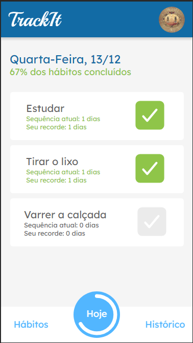
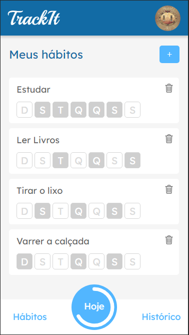
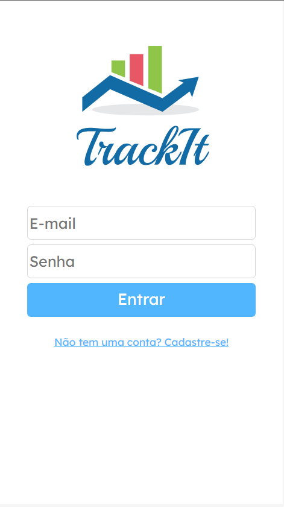
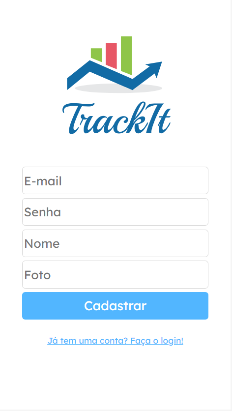

## TrackIt

Não é facil manter um hábito mas o <strong>TrackIt</strong> deixa tudo mais simples, utilizando <strong>React+Vite</strong> desesnvolvi um app de gerenciamento de rotina onde é possivel marcar suas rotinas e desenvolver o hçabito de faze-las.

## Demo

###### <a href="https://track-it-three-mu.vercel.app/">Deploy</a>

###### <a href="https://youtu.be/O_PWXb6baww">Video Demonstração</a>

###### <a href="https://hub.docker.com/r/caioneme/trackit">DockerHub</a>

## Preview

##### Design (Hoje)

##### Design (Hábitos)

##### Design (Login)

##### Design (Cadastro)

## Tecnologias e bibliotecas

- React
- Vite
- Styled Components
- Axios
- DayJs

## Como rodar

1. Rode o comando `git clone https://github.com/CaioNeme/TrackIt-FrontEnd.git`
2. Rode o comando `cd cd TrackIt-FrontEnd`
3. Rode o comando `npm i`
4. Configure o aquivo `.env` se baseando no arquivo `.env.example`
5. Rode o comando `npm run dev`
